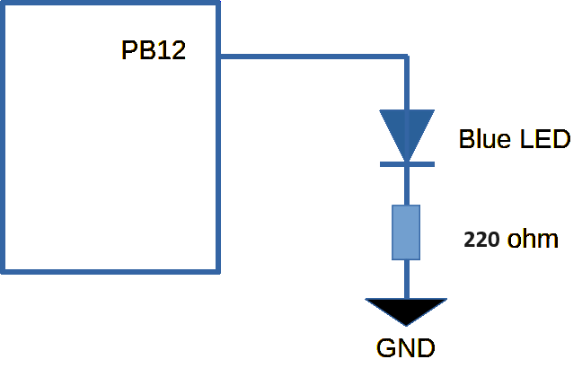

## README_blink.md
# Blinking LEDs

* Platform: STM32
* Board: STM32F411CEU6 (BlackPill)
* Copyright (C) 2024 KW Services.
* MIT License
* MicroPython 1.20

### Scope.

Turning on/off LEDs on the BlackPill board.

Examples:
1. Blink built-in blue LED using LED() function.
1. Blink blue LED at PC13 using Pin().
1. Blink an external LED at PB12 using Pin().
1. Blink an external LED at PC13 using Pin() (machine module).


#### BlackPill for STM32F411CEU6.
>The built-in Blue LED on the BlackPill is located at pin PC13.  At boot, the BlackPill briefly flashes the LED.
It will also flash the LED during certain functions (e.g. save to the virtual flash drive).  

The MicroPython code on the Black Pill was enhanced 
by the WeAct Studios update (when you built and deployed the firmware.)
 

[Link to pinout diagram](images/STM32F411_Pinout_h.png)

## 1. Blink built-in blue LED using LED() function.
There is a <b>pyb</b> function called LED to operate builtin LEDs.  The BlackPill has only one dedicated LED.  

Quick look:
```python
from pyb import Pin, LED
import time

led = LED(1)
led.on()
time.sleep(1)
led.off()
```
[Link to an example](/pyb_LED.py)

When the program starts it prints a brief explanation and then waits for you to press the User button
whereupon it will blink the blue LED briefly.  
You can type 'Control-c' at any time to interrupt the program (or click the red 'Stop' to soft boot the MCU). 
See the two definitions (TurnOn and TurnOff) in the code below.  

>You can also Paste the code into Thonny's Untitled pane and the pane will perform each command line.  

## 2. Blink the LED at PC13 using Pin().
 
The user can light the LED using the Pin command. 

Quick look:
```python
from pyb import Pin
import time

led = Pin('PC13', mode=Pin.OUT)
led.on()
time.sleep(1)
led.off()
```

[Link to example](/pyb_led_pc13.py)
 

## 3. Blink an external LED at PB12 using Pin().
An LED is wired to pin PB12 and the negative side is connected to a resistor and subsequently to ground.



Quick look:
```python
from pyb import Pin
import time

led = Pin('PB12', mode=Pin.OUT)
led.on()
time.sleep(1)
led.off()
```

[Link to example code](/pyb_led_pb12.py)

## 4. Blink an external LED at PC13 using Pin() (machine module).
Some features use the **machine** module instead of the **pyb** module.  
The machine module has the same Pin function. 

Let's try the code again using machine.

Quick look:
```python
from machine import Pin
import time

led = Pin('PC13', mode=Pin.OUT)
led.on()
time.sleep(1)
led.off()
```

[Link to example code](/machine_led_pb12.py)

> or...
>
> import machine
>
> led = machine.Pin('PC13', mode=Pin.OUT)

## Conclusion.
One can use either the pyb or machine module for simple GPIO functions like Pin.  This is not always the case as not all functions are in both modules.


## References.

MicroPython docs 'latest' September 07, 2023: https://docs.micropython.org/en/latest/